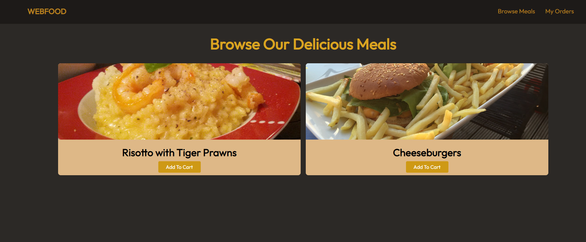
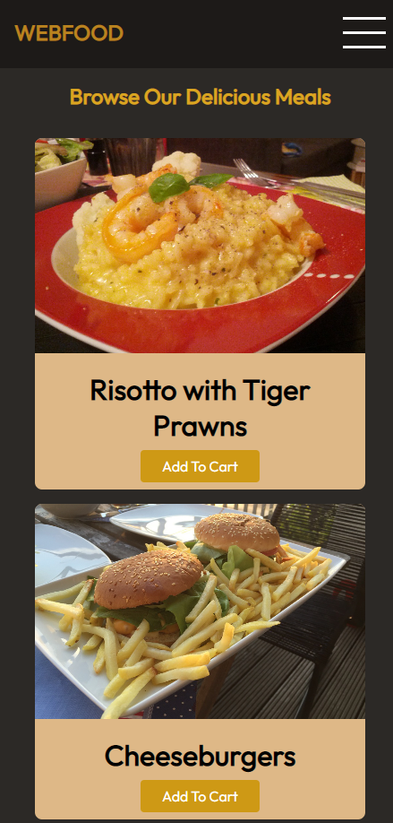

# WeebFood responsive page

This is the fist responsive page i made following along a course im taking in udemy. 

## Table of contents

- [Overview](#overview)
  - [Screenshot](#screenshot)
  - [Links](#links)
- [My process](#my-process)
  - [Built with](#built-with)
- [Author](#author)

## Overview

### Screenshot

### Links

- Live Site URL: [https://morbitdemon.github.io/HTML-CSS-Basics-Summary/]

## My process

- Focused and completed the structure and design on desktop first.
- Added media queries modified units to make the page responsive
- Added features exclusive to the portrait version.

### Built with

- Semantic HTML5 markup
- CSS custom properties
- CSS Flexbox
- CSS Grid

## Author

 [@MorbitDemon](https://github.com/MorbitDemon)
